# 🚀 Task Management System - Backend (Spring Boot)


This is the backend service for the Task Management System, built using **Spring Boot, Spring Security, Hibernate, and MySQL**. It provides a REST API for managing users, tasks, notifications, comments and attachments.

--- 

### 💻Live experience: https://taskmaster128.netlify.app
### 🛫Consume Restful web-services: https://taskmaster-v1.onrender.com/api

 <video width="100%" controls>
  <source src="Media/auth.mp4" type="video/mp4">
  Your browser does not support the video tag.
</video>

<video width="100%" controls>
  <source src="Media/task.mp4" type="video/mp4">
  Your browser does not support the video tag.
</video>

---
## Table of Contents

- [Features](#-features)
- [Technologies Used](#-tech-stack)
- [Setup Instructions](#-setup-instructions)
- [API Documentation](#apis)
- [Database Schema](#-database)
- [Deploying the Application](#-deployment)
- [Screenshots](#-screenshots)
- [License](#-license)
---

## **📌 Features**
- ✅ **User Authentication & JWT Authorization** (Login, Signup, Forgot Password, Role-based Access)
- ✅ **Task Management** (Create, Update, Assign, Delete, Change Status & Priority)
- ✅ **Comments & Notifications** (Users can comment & get real-time notifications)
- ✅ **File Attachments** (Upload & download files)
- ✅ **Role-based Authorization** (`ADMIN` & `USER`)
- ✅ **Pagination & Sorting** for Task Lists
- ✅ **CORS Support** (Cross-Origin Requests)

---

## **📌 Tech Stack**
- **Spring Boot 3**
- **Spring Security (JWT)**
- **Hibernate & JPA**
- **MySQL**
- **Lombok**
- **Swagger (API Documentation)**
- **Maven**
- **Docker** *(Optional)*

---

## **📌 Setup Instructions**

### Prerequisites
- Java 17
- MySQL 8.0
- Maven 3.8+

### **1️⃣ Clone the Repository**
```bash
https://github.com/Pranav128/Task-management-system-frontend.git
```

### **2️⃣ Configure MySQL Database**
```bash
Create a MySQL database named task_management_db
Update src/main/resources/application.properties
```

### **3️⃣ Run the Application**
```bash
mvn clean spring-boot:run
```
📌 Backend is now running on http://localhost:8080/api

--- 

## **📌API's**

This document outlines the available API endpoints for the application.

### **🛠Authentication**

| Method | Endpoint                    | Description                |
|--------|-----------------------------|----------------------------|
| POST   | `/api/auth/signup`          | Register a new user        |
| POST   | `/api/auth/login`           | Login & receive JWT token  |
| POST   | `/api/auth/forgot-password` | Send reset link to email   |
| POST   | `/api/auth/reset-password`  | Reset password using token |

### **📃Task Management**

| Method | Endpoint          | Description                     |
|--------|-------------------|---------------------------------|
| GET    | `/api/tasks`      | Get all tasks (with pagination) |
| POST   | `/api/tasks`      | Create a new task               |
| PUT    | `/api/tasks/{id}` | Update task details             |
| DELETE | `/api/tasks/{id}` | Delete a task                   |

### **🔔Comments & Notifications**

| Method | Endpoint                      | Description                    |
|--------|-------------------------------|--------------------------------|
| POST   | `/api/comments/{taskId}`      | Add a comment to a task        |
| GET    | `/api/notifications/{taskId}` | Fetch notifications for a task |


--- 


## **📌 Database**
**ERR Diagram**

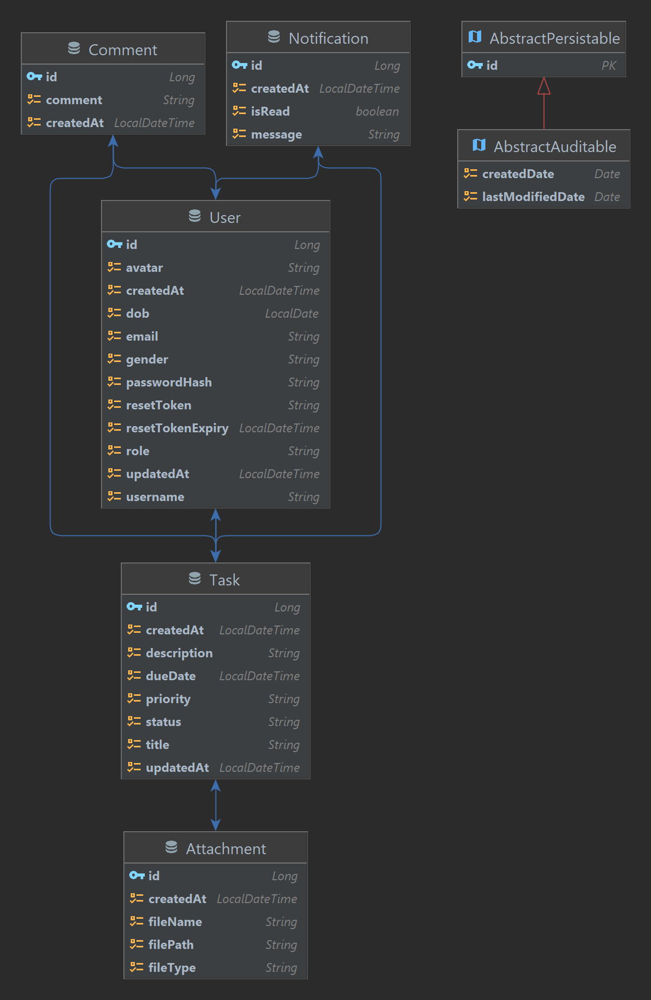
--- 


## **📌 Deployment**

### **🛠 Build JAR**
```bash
mvn clean package -DskipTests
```

### **🚀 Run JAR**
```bash
java -jar target/task-management-system.jar
```
### **🐳 Docker Deployment**
```bash
docker build -t task-management-backend .
docker run -p 8080:8080 task-management-backend
```
--- 


## **📌 Screenshots**

1. **Home Page**
   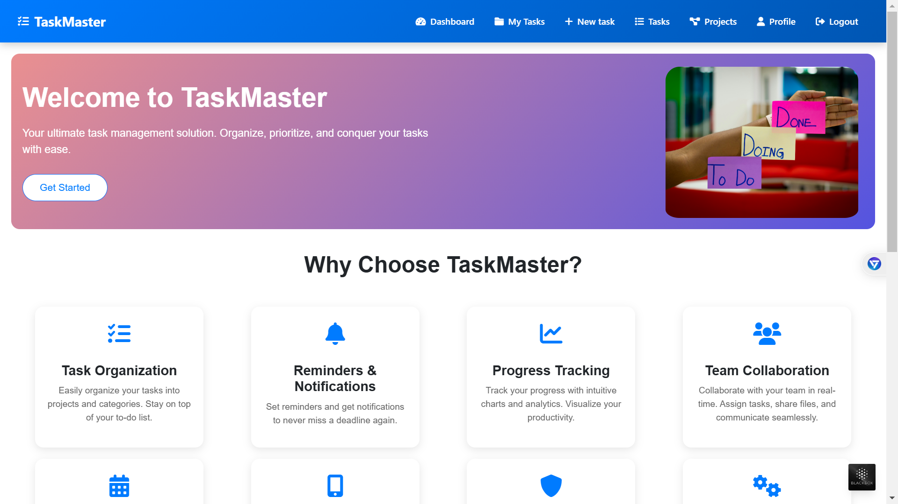
2. **Signup Page**
   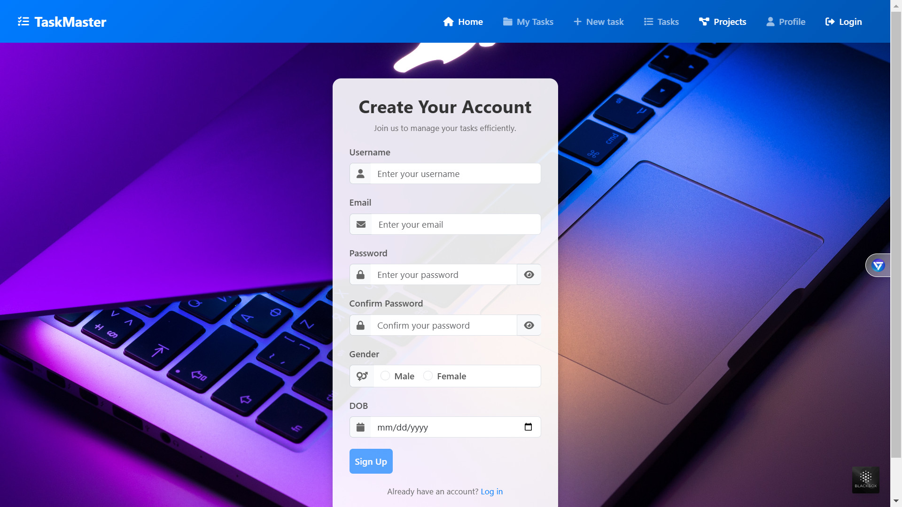
3. **Login Page**
   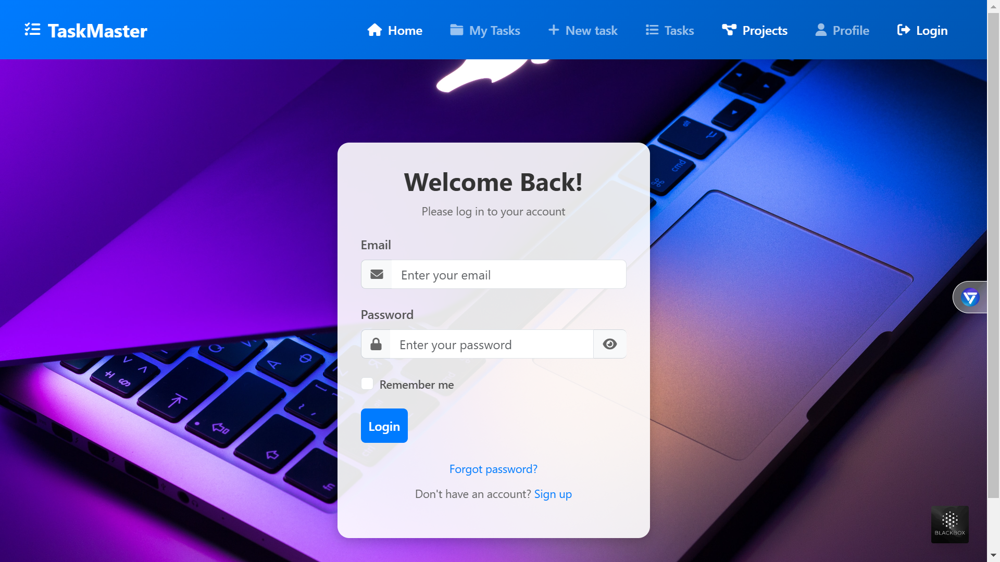
4. **Dashboard Page**
   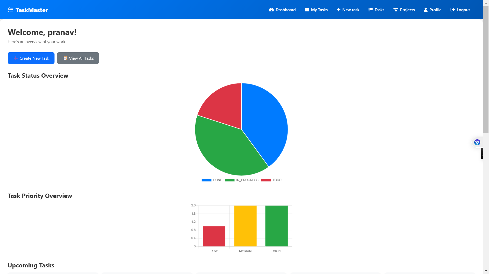
5. **Task List Page**
   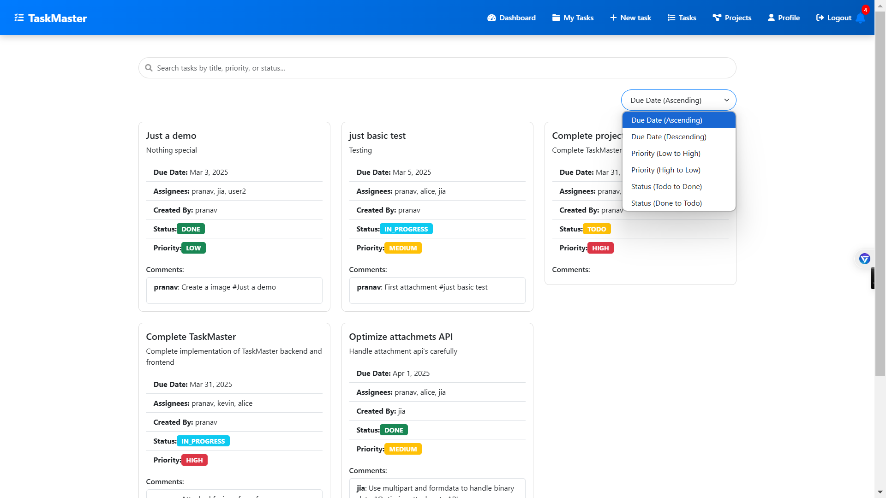
6. **Task Details Page**
   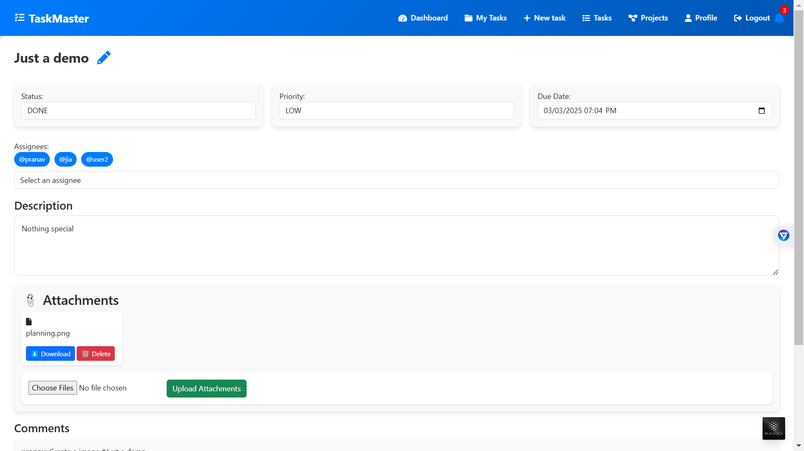
   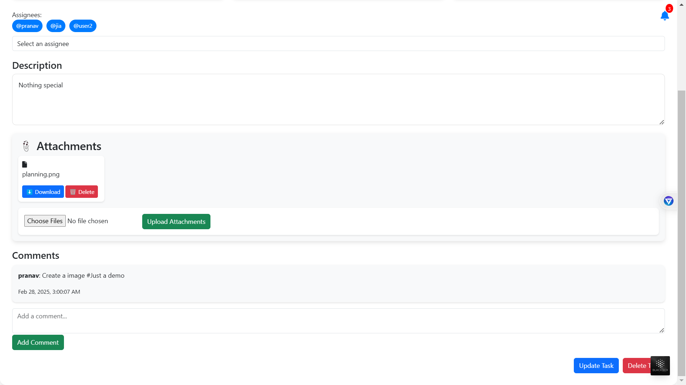
7. **New Task Page**
   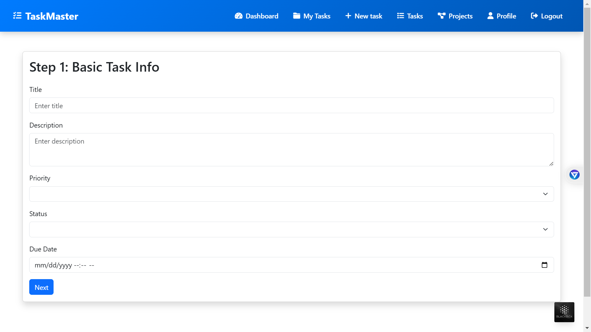
   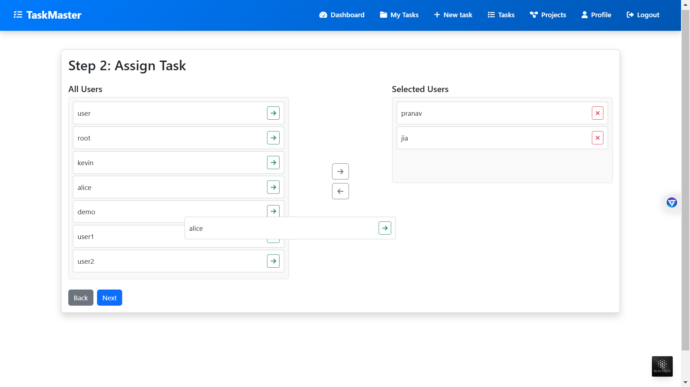
   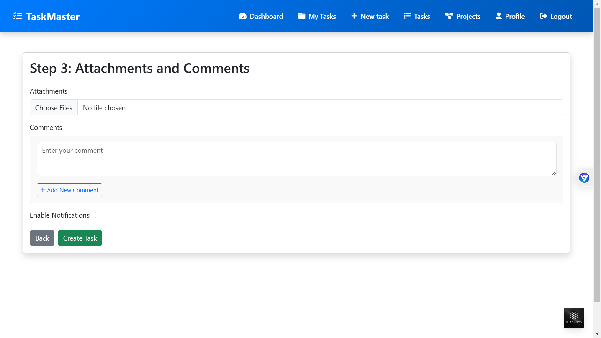
8. **Profile Page**
   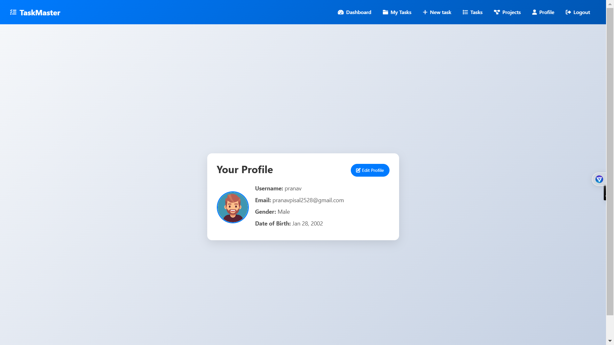
   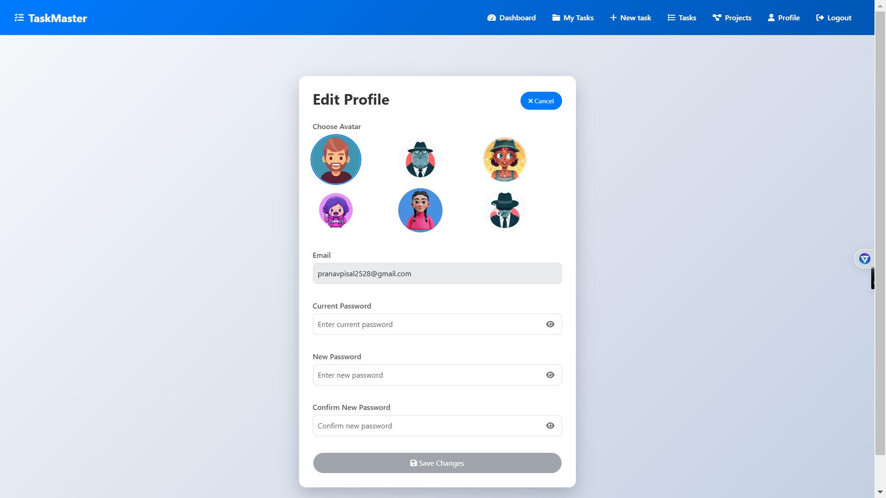
9. **Forgot-Password Page**
   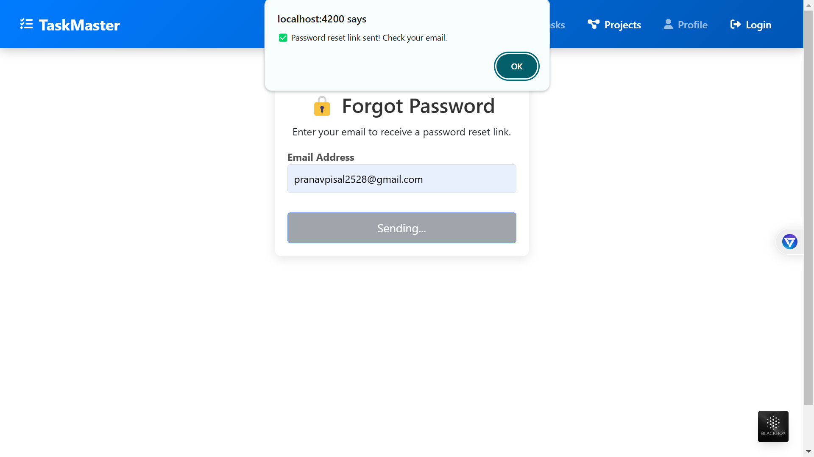
10. **Reset-Password Page**
    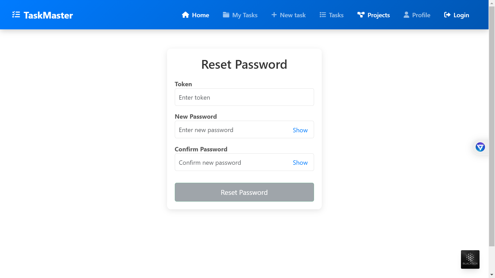
11. **Access-denied Page**
    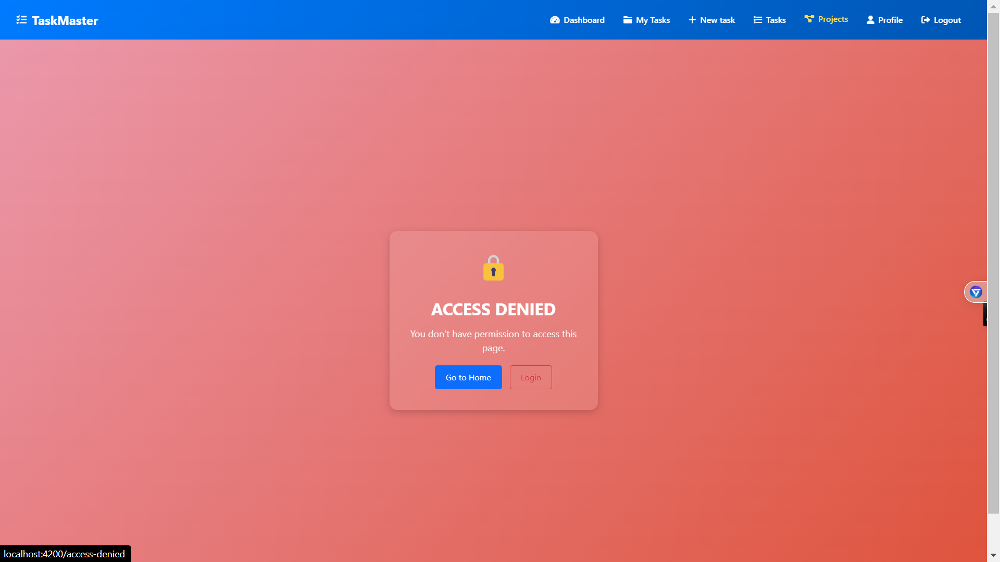

---

## **📌 License**
**This project is licensed under the MIT License. See the [LICENSE](/LICENSE) file for details.**

--- 
